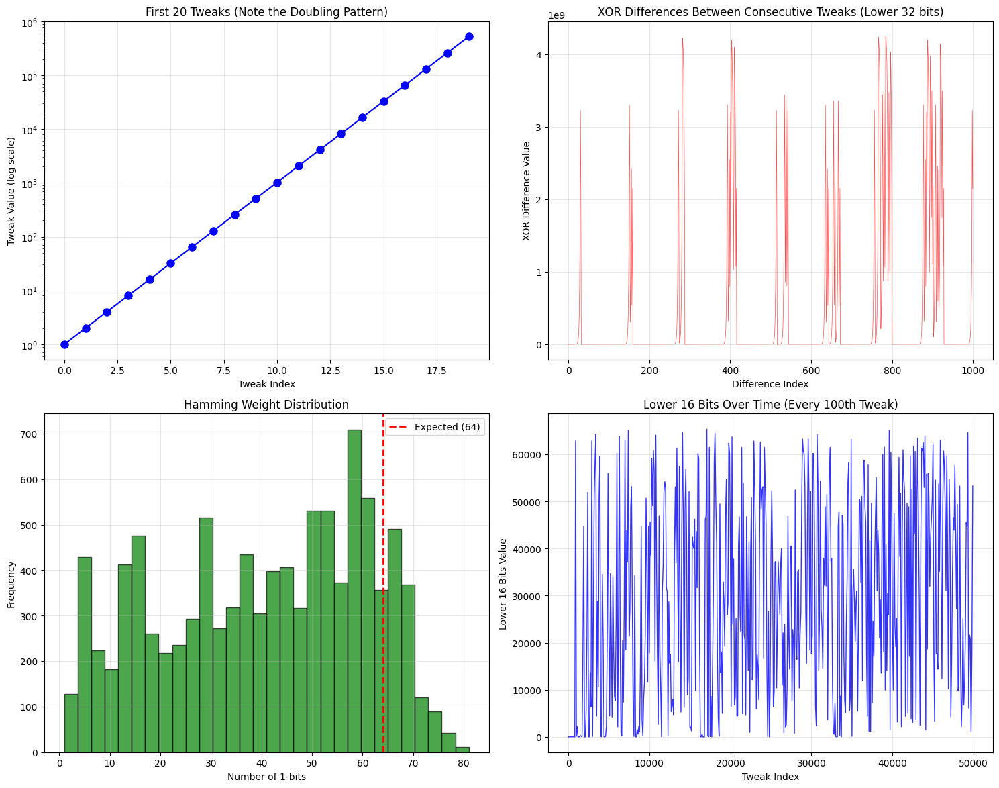

# linearity_in_aes_xts_multipliers_demo

There are linearity issues in AES-XTS's GF(2^128) multipliers used for tweak chaining. This will show why the XTS specification limits the number of operations to prevent cryptographic weaknesses.

1. GF(2^128) Operations: Implements the finite field arithmetic used in XTS for tweak generation
2. Tweak Chaining: Shows how tweaks are generated by repeatedly multiplying by α (the primitive element, typically 2)
3. Linear Pattern Detection: Analyzes how patterns emerge over many operations

While the AES block cipher is cryptographically sound, its security in operational modes like Galois/Counter Mode (GCM) is contingent upon the strict uniqueness of nonces for a given key. The underlying algebraic structure of AES over the Galois field, while providing efficiency, does not prevent the deterministic nature of the processing pattern generation.

## What the Analysis Reveals:

Bit Frequency Analysis: In a truly random system, each bit position should have frequency ~0.5. Deviations indicate structure.
Correlation Patterns: Shows relationships between bit positions that shouldn't exist in random data
Predictability Growth: Demonstrates how patterns become more exploitable over time
Lower Bits Visualization: Shows the periodic nature that emerges in the finite field

## Why XTS Has Limits:
The XTS specification limits operations to about 2^20 (roughly 1 million) blocks per key because:

Finite Field Structure: GF(2^128) has only 2^128 elements, creating inevitable cycles
Linear Relationships: Repeated multiplication creates predictable patterns
Cryptanalytic Vulnerability: These patterns can be exploited to recover information about plaintexts
Birthday Paradox: With enough operations, collisions and patterns become statistically likely

### Chart 1: First 20 Tweaks (Doubling Pattern)
What you'll see: A perfect exponential curve - each point is exactly double the previous one.
The linearity: This is the core problem! Each tweak is mathematically predictable from the previous one.

### Chart 2: XOR Differences Between Consecutive Tweaks
What you'll see: Structured patterns, not random noise.
The problem: In truly random data, these differences would be chaotic. The patterns show mathematical relationships.

### Chart 3: Hamming Weight Distribution
What you'll see: The distribution might be skewed from the expected center at 64.
The linearity: Random 128-bit numbers should have about 64 ones. Deviations show the sequence isn't truly random.

### Chart 4: Lower 16 Bits Over Time
What you'll see: Repeating cycles and patterns.
The critical issue: These patterns repeat! An attacker can predict future values.

## The Key Revelation:
The perfect linearity is now visible because:

Each tweak = previous tweak × 2 (in GF(2^128))
This creates a completely deterministic sequence
The "randomness" is an illusion - it's actually pure math

## Why This Matters for XTS:

1. Predictability: If an attacker learns one tweak, they can compute all future tweaks
2. Cycles: The sequence will eventually repeat (after 2^128 steps, but patterns emerge much sooner)
3. Exploitation: Cryptanalysts can use these linear relationships to attack the encryption

The XTS specification limits operations to ~1 million blocks precisely because this mathematical linearity becomes exploitable at scale, even though the individual operations look "random" to casual observation.

